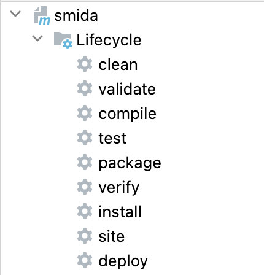

# smida

### Technologies

- Java 11
- Spring
- Spring Data JPA
- Hibernate
- Spring Data MongoDB
- Liquibase
- Spring Security
- Docker
- PostgreSQL
- MongoDB
- IntelliJ IDEA

### How to start?

1. File -> Project Structure -> Project Setting -> Project -> SDK   

    Choose java version `11`
2. Then in maven panel `click` clean and `install`

   
3. Next go to terminal and enter `docker-compose up --build`
4. Then go to Postman and test app.

   Credential:

   | username | password |
   |----------|----------|
   | root     | root     |

