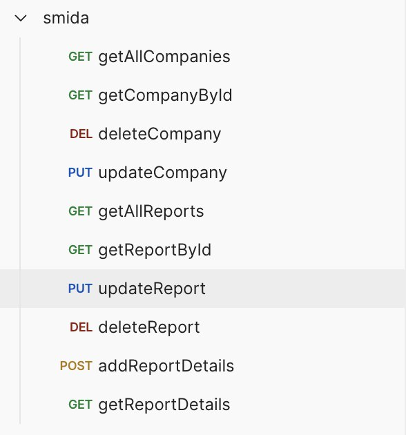

# smida

### Technologies

- Java 11
- Spring
- Spring Data JPA
- Hibernate
- Spring Data MongoDB
- Liquibase
- Spring Security
- Docker
- PostgreSQL
- MongoDB
- IntelliJ IDEA

### How to start?

In the terminal enter `docker-compose up --build`

### How to use?

Import Postman collection `smida.postman_collection.json` and test app.

   

   Credential for Basic Auth:

   | username | password |
   |----------|----------|
   | root     | root     |

